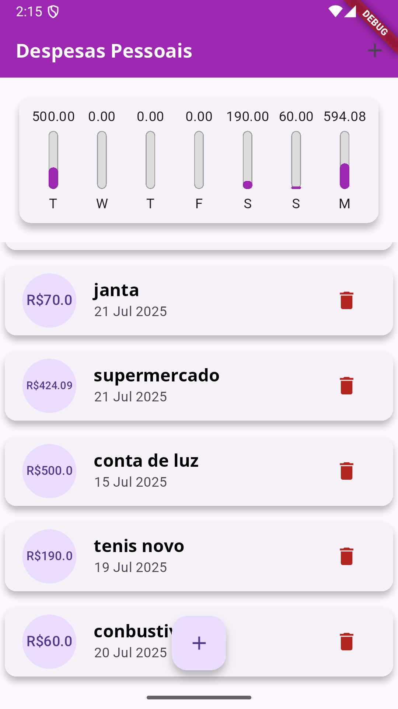
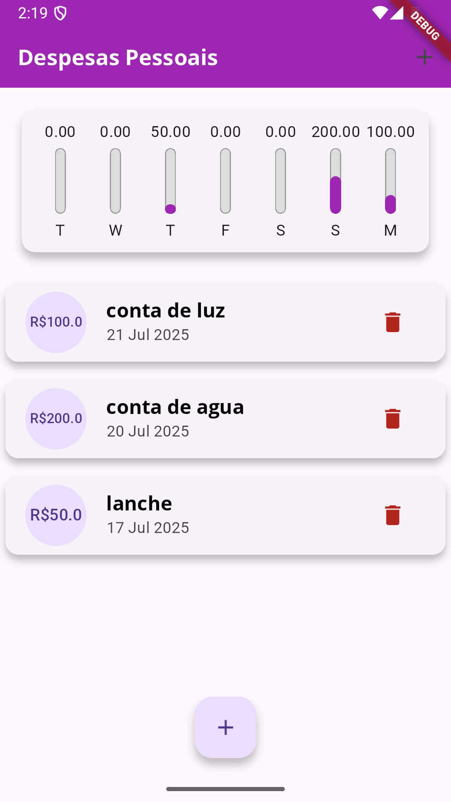

# 💰 Personal Expenses - Controle de Despesas com Flutter

## 📷 Imagens do App
  

Este projeto é um aplicativo de **controle de despesas pessoais** desenvolvido com **Flutter** e **Dart**, onde o usuário pode registrar gastos, visualizar uma lista de transações e acompanhar um gráfico semanal dos seus gastos.

## ✨ Funcionalidades

- Adição de novas transações com título, valor e data.
- Lista de transações recentes com exibição formatada.
- Gráfico de barras mostrando os gastos dos últimos 7 dias.
- Interface responsiva e adaptável (modo paisagem e retrato).
- Validação de campos de entrada e interação com datas.

## 🛠️ Tecnologias e Conceitos Utilizados

Durante o desenvolvimento, foram explorados diversos conceitos fundamentais do Flutter e Dart, como:

- **Widgets Stateless e Stateful**
- **ListView e Column com scroll**
- **Controllers e formulários**
- **Comunicação entre componentes via callbacks**
- **Lógica de filtro de dados**
- **Uso de pacotes como `intl` para formatação de datas e moedas**
- **Gerenciamento de estado local sem bibliotecas externas**
- **MediaQuery e LayoutBuilder para responsividade**

## 📚 O que eu aprendi

Ao programar este aplicativo, aprofundei meus conhecimentos nos seguintes pontos:

- Criação de interfaces reutilizáveis e desacopladas.
- Comunicação entre widgets usando funções anônimas.
- Manipulação de listas e filtragem de dados em Dart.
- Uso de pacotes externos (como o `intl`) para internacionalização.
- Adaptação de layouts para diferentes orientações de tela.
- Organização de projeto Flutter com separação de responsabilidades em arquivos distintos.

## ▶️ Como executar

1. Clone este repositório:
   ```bash
   git clone https://github.com/seu-usuario/nome-do-repositorio.git
   ```

2. Navegue até a pasta:
   ```bash
   cd nome-do-repositorio
   ```

3. Instale as dependências:
   ```bash
   flutter pub get
   ```

4. Execute o app:
   ```bash
   flutter run
   ```

